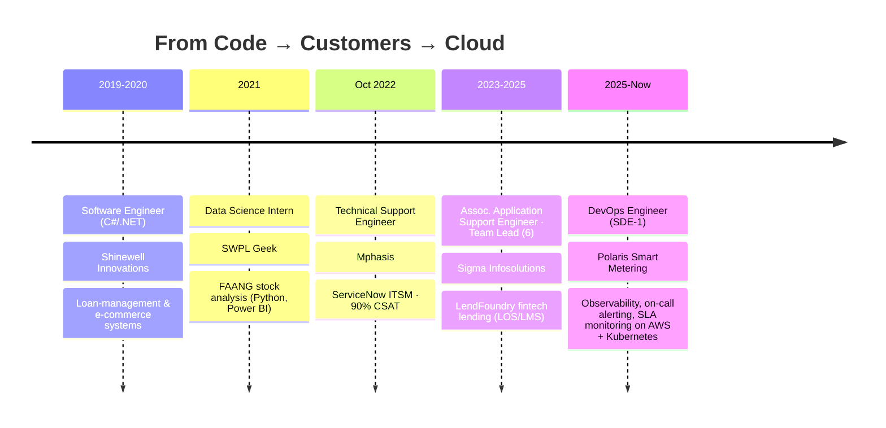

<!-- ═══════════════════════════ HEADER ═══════════════════════════ -->
<div align="center">


<a href="https://git.io/typing-svg">
  
</a>

<br/>

<a href="https://www.linkedin.com/in/priyanka-gupta-3b0856153/"></a>
<a href="mailto:priyanka.gupta7679@gmail.com"></a>
<a href="https://github.com/priyankagupta7679/priyankagupta7679/raw/main/Priyanka_Gupta_Resume.pdf"></a>

<a href="https://www.credly.com/badges/0c6fe534-afd4-45a7-bacd-46888d30cdff/public_url"></a>


</div>

---

## 👩‍💻 About Me

```yaml
name:        Priyanka Gupta
role:        DevOps Engineer (SDE-1) @ Polaris Smart Metering
experience:  5+ years in IT across Software Engineering → Support → Team Lead → DevOps
location:    Jaipur, India 🇮🇳
focus:       [Observability, On-call Alerting, SLA Monitoring, AWS, Kubernetes, Incident Response]
superpower:  "Turning noisy production into clear dashboards and actionable alerts"
soft_skills: [Client Handling, Team Leadership, Clear Communication, Ownership]
currently:   Running observability & $0-cost on-call alerting for 5 production environments
certified:   AWS Certified Cloud Practitioner (2025)
education:   MCA + BCA in Computer Science (Honours)
learning:    [Terraform at scale, ArgoCD / GitOps, Kubernetes internals]
```

I'm a **DevOps Engineer (SDE-1)** with an SRE mindset, and I came up the *hard, useful way*: I've written code, supported customers, led a team, and now I run and monitor production infrastructure. So I understand a production problem from all three sides — **the code, the customer, and the cloud**. 🌩️

- 🔭 I run observability & alerting for **5 production environments** of an IoT smart-metering platform (HES / MDMS / WFM)
- 📟 I set up **Grafana OnCall** with escalation chains and voice-call escalation at **$0 licence cost**
- 📊 I build **SLA dashboards** that are used for daily RCA reports and monthly client availability reports
- 🚨 I design **alert pipelines** that route alerts by category and severity, and tune thresholds so the on-call team isn't flooded with noise
- 💸 I **audit cloud costs** and find orphaned volumes and forgotten resources that are still billing
- 🤝 I've **led a team of 6** and handled enterprise fintech clients directly

---

## 🛠️ Tech Stack

<details open>
<summary><b>☁️ Cloud & Infrastructure</b></summary>
<br/>


-231F20?style=for-the-badge&logo=apachekafka&logoColor=white)


</details>

<details open>
<summary><b>🐳 Containers & Orchestration</b></summary>
<br/>


</details>

<details open>
<summary><b>📈 Observability & Monitoring (my home turf 🏡)</b></summary>
<br/>


-F46800?style=for-the-badge&logo=grafana&logoColor=white)


</details>

<details open>
<summary><b>📨 Messaging, Data & Caching</b></summary>
<br/>


-00B173?style=for-the-badge&logo=mqtt&logoColor=white)


</details>

<details open>
<summary><b>⚙️ CI/CD, Scripting & Collaboration</b></summary>
<br/>


</details>

---

## 🏆 Impact Highlights

<table>
<tr>
<td width="50%" valign="top">

### 📟 $0 On-Call with Grafana OnCall
Set up **Grafana OnCall** with escalation chains, **voice-call escalation** and MS Teams integration for **25+ critical production alerts**, all at **zero licence cost**.

</td>
<td width="50%" valign="top">

### 🚨 Zero-Cost Teams-Direct Alerting
Rebuilt alerting so **CloudWatch, Prometheus and Zabbix go straight to MS Teams**. It uses a small serverless relay (SNS + Lambda + least-privilege IAM) and native Alertmanager receivers, with no paid on-call dependency.

</td>
</tr>
<tr>
<td width="50%" valign="top">

### 🔍 Found Silent Alert Failures
Audited alert delivery across **4 production environments** and found broken notification templates that had **silently blocked alerts from reaching anyone**. I fixed and verified every channel end to end, and split alerts by category.

</td>
<td width="50%" valign="top">

### 📊 SLA Dashboards & Client Reporting
Built **Grafana SLA dashboards** (Zabbix SLA API + Infinity datasource, dashboards-as-code in Python). They drive **daily SLA reports with RCA** and **monthly client availability reports**.

</td>
</tr>
<tr>
<td width="50%" valign="top">

### 🤖 Automated Daily Health Reports
Wrote **Python AWS Lambda** jobs, scheduled with **EventBridge**. Each morning they post EKS node, RDS, Redis and Kafka (MSK) health to Teams, and I fixed a triple-posting bug along the way.

</td>
<td width="50%" valign="top">

### 💸 Cloud Cost & Observability Audit
Audited **5 environments** and identified **~$115/month** of waste (orphaned PVCs, frozen log buckets, stopped-instance volumes). Also found and fixed an eBPF tracing bug that had stopped distributed traces.

</td>
</tr>
</table>

---

## 🧭 Career Journey



| 📅 Period | 🏢 Company | 💼 Role | ✨ What I did |
|---|---|---|---|
| **Jul 2025 – Present** | **Polaris Smart Metering** | DevOps Engineer (SDE-1) | Grafana OnCall at $0 licence cost. Observability with Grafana / Prometheus / Loki / Zabbix / SigNoz. Alert routing to Teams, SLA dashboards, Lambda automation, EKS & Kafka monitoring, cost audits |
| **Feb 2023 – Feb 2025** | **Sigma Infosolutions** | Assoc. Application Support Engineer · **Team Lead (6)** | Led a 6-member team. Jenkins/Bitbucket CI/CD, CloudWatch + OpenSearch Dashboards, RabbitMQ tracing, PostgreSQL tuning, client handling |
| **Oct 2022 – Feb 2023** | **Mphasis** | Technical Support Engineer | ServiceNow ITSM with a 90% end-user satisfaction rate. L1/L2 support for AD, DNS, Citrix, VPN and O365 |
| **Feb – Jul 2021** | **SWPL Geek** | Data Science Intern | Python scrapers (BeautifulSoup, Selenium) and Power BI dashboards for FAANG stock analysis |
| **Mar 2019 – Mar 2020** | **Shinewell Innovations** | Software Engineer (C#/.NET) | Loan-management systems, SQL Server, and an e-commerce platform built from scratch |

---

## 📂 Featured Projects

<div align="center">

| Project | What it shows | Stack |
|---|---|---|
| 🔭 [**devops-observability-stack**](https://github.com/priyankagupta7679/devops-observability-stack) | Metrics, logs, traces and alerts on Kubernetes using Helm | Prometheus · Grafana · Loki · Tempo · Alertmanager |
| 🚨 [**cloud-alerting-to-teams**](https://github.com/priyankagupta7679/cloud-alerting-to-teams) | Serverless $0 alert relay: CloudWatch → Lambda → MS Teams | AWS Lambda · SNS · IAM · Python |
| 📊 [**sla-monitoring-automation**](https://github.com/priyankagupta7679/sla-monitoring-automation) | SLA dashboards, plus daily health reports posted to Teams | Zabbix API · Grafana · EventBridge · Python |
| 📚 [**Start-your-journey-for-devops**](https://github.com/priyankagupta7679/Start-your-journey-for-devops) | 🗺️ Roadmap → 🧪 Labs → 🎯 Interview Prep — start your DevOps journey | Docker · K8s · Terraform · Helm · ArgoCD · AWS |

</div>

---

## 🎓 Certifications & Education

| | |
|---|---|
| 🏅 **AWS Certified Cloud Practitioner** · 2025 | [View on Credly](https://www.credly.com/badges/0c6fe534-afd4-45a7-bacd-46888d30cdff/public_url) |
| ☁️ **AWS Educate: Introduction to Cloud 101** · 2025 | [View on Credly](https://www.credly.com/badges/08a4995c-fc11-46eb-9f4c-01d26e1adf1e/public_url) |
| 🐍 LinkedIn Learning: Python Essential Training, SQL Essential Training, Statistics Foundations · 2022 | |
| 🎓 **MCA, Computer Science** (Honours) · 2021 | Lachoo Memorial College of Science & Technology, Jodhpur |
| 🎓 **BCA, Computer Science** (Honours) · 2019 | Lachoo Memorial College of Science & Technology, Jodhpur |

---

## 🌱 Want to Start Your Own DevOps Journey?

<div align="center">

**I switched into DevOps from support, after a career gap, so I know how confusing the path looks from the outside.**
I put together everything that helped me, in order:

<a href="https://github.com/priyankagupta7679/Start-your-journey-for-devops/blob/main/ROADMAP.md"></a>
<a href="https://github.com/priyankagupta7679/Start-your-journey-for-devops/tree/main/labs"></a>
<a href="https://github.com/priyankagupta7679/Start-your-journey-for-devops/tree/main/interview-prep"></a>

`Linux → Git → Docker → AWS → Terraform → Kubernetes → Helm → ArgoCD → Observability → CI/CD → 🎯 Hired`

</div>

---

## 📊 GitHub Stats

<div align="center">


</div>

---

## 💬 How I Work

> 🔎 **Check what already exists before building anything new.** Most "missing" monitoring is already running somewhere. Someone just forgot about it.
>
> 💰 **Cost is a feature.** Before adding any new infrastructure, I first ask whether we can do it at $0 with what we already run.
>
> ✅ **An untested alert is only a hope.** I don't call an alert done until I've seen it arrive in the channel.
>
> 📣 **Communicate clearly and early.** Clients and leadership should hear about a problem from us first, with a clear root cause.

---

<div align="center">

### 🤝 Let's build reliable systems together!

**Open to DevOps · SRE · Cloud / Platform Engineer roles**

<a href="https://www.linkedin.com/in/priyanka-gupta-3b0856153/"></a>
<a href="mailto:priyanka.gupta7679@gmail.com"></a>


</div>
